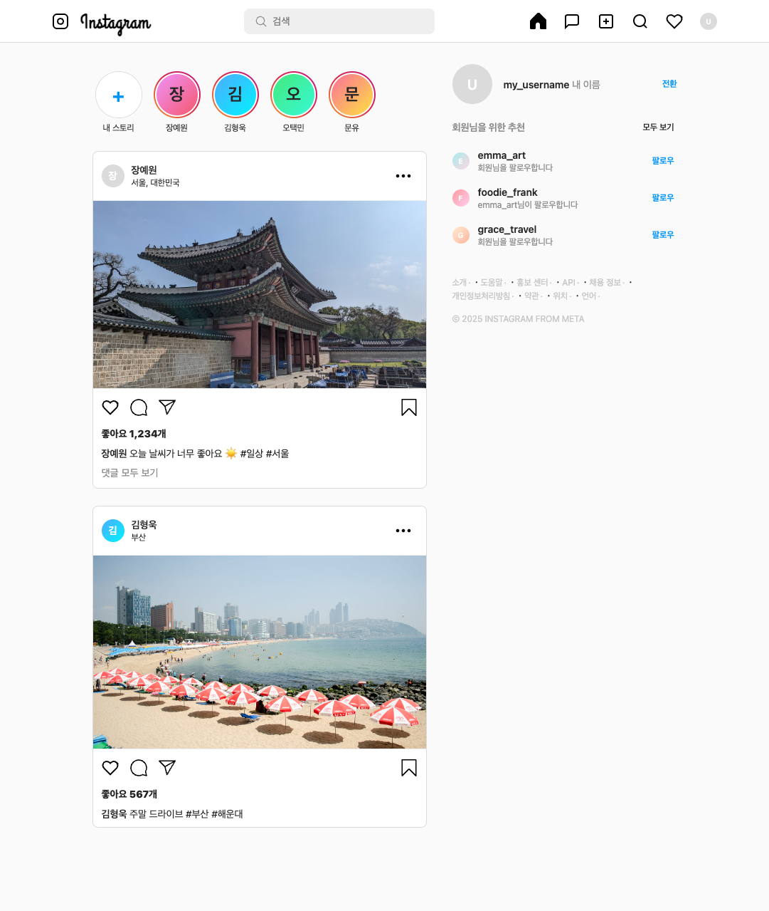

# Instagram UI Clone

A pixel-perfect, responsive replica of the Instagram web interface, built with HTML5 and modular CSS.



## 🚀 Features

- **Modular Architecture**: CSS styles are split into logical modules (`general`, `header`, `feed`, `sidebar`, `responsive`) for better maintainability.
- **Authentic Assets**: 
  - Replaced emojis with real **SVG icons** extracted from the official Instagram web interface.
  - High-quality sample images for feed posts (Seoul & Busan).
- **Responsive Design**: 
  - Adapts to different screen sizes.
  - Sidebar automatically hides on smaller screens (< 935px).
- **Modern Styling**:
  - Uses **CSS Variables** for consistent theming and easy maintenance.
  - Flexbox layout for precise alignment.
  - "Grand Hotel" font for the logo.

## 📂 Project Structure

```
/
├── index.html            # Main markup
├── styles/               # CSS Modules
│   ├── general.css       # Variables & Reset
│   ├── header.css        # Navigation bar
│   ├── feed.css          # Posts & Stories
│   ├── sidebar.css       # Suggestions & Footer
│   └── responsive.css    # Media queries
└── assets/
    ├── icons/            # SVG Icons (Home, Search, Like, etc.)
    └── images/           # Sample post images & README preview
```

## 🛠️ Usage

Simply open `index.html` in any modern web browser.

```bash
# Using Python simple server (optional)
python3 -m http.server 8080
# Then visit http://localhost:8080
```

## 📸 Credits

- **Icons**: Authentic Instagram SVG paths.
- **Images**:
  - Gyeongbokgung Palace (Seoul): [Pixnio](https://pixnio.com/) (Public Domain)
  - Haeundae Beach (Busan): [Wikimedia Commons](https://commons.wikimedia.org/) (CC BY 2.0)
